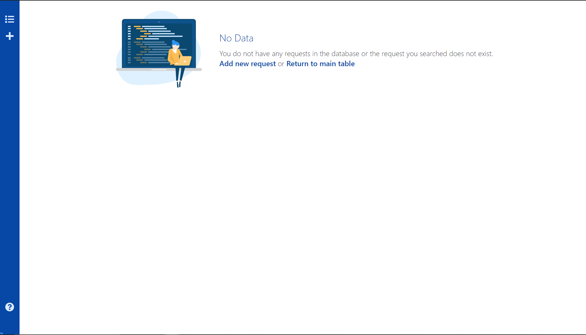
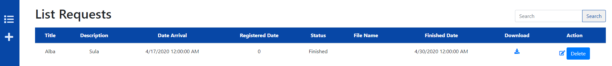
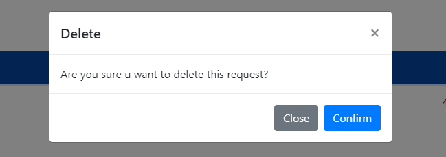
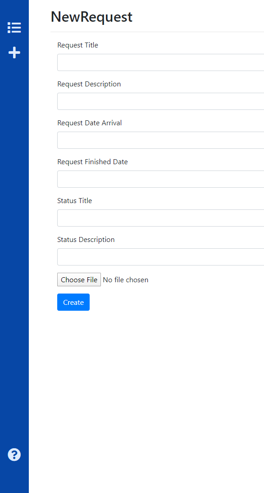
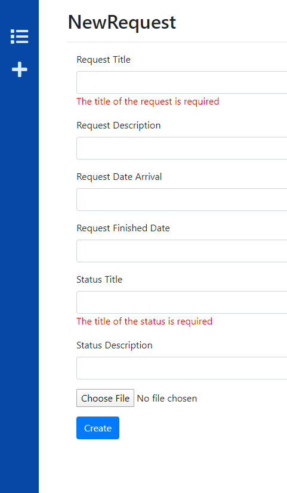
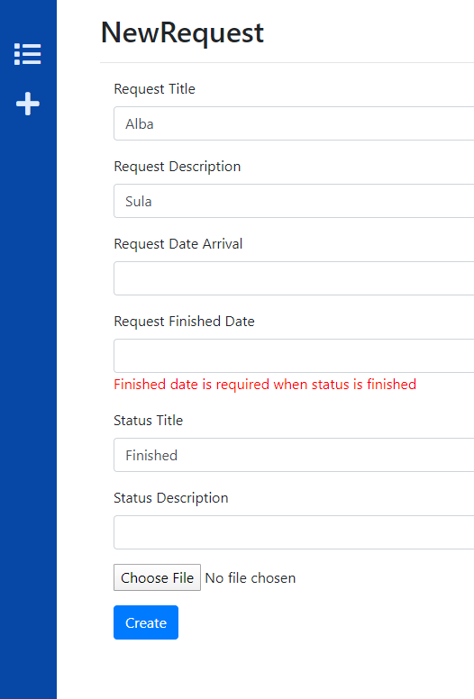
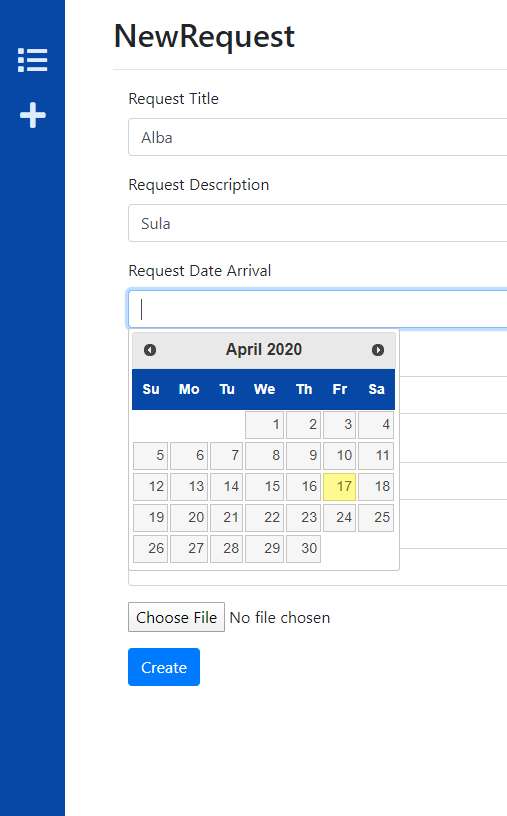
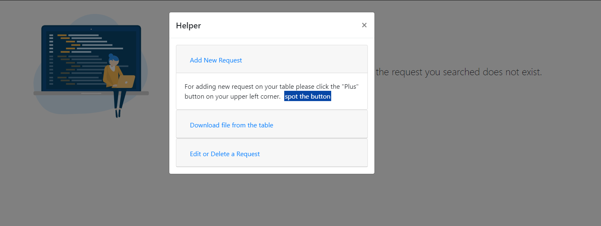

# RepoRequest
This is a project created with ASP.NET MVC. 

This project includes CRUD, MVC architecture, Database First Approach.

# This is the main page

In the main page you have :
1. No requests in the database
    1. Add new requests => Redirects you to the Add View
    2. Return to main page => Redirects you to the table page if you already have requests in the database
2. The thre lines icon takes you to list table
3. +icon takes you to Add request
4. ? icon takes you to a helper modal

# The list of requests

### The Confirm Modal when trying to delete a request

# +Icon takes you to Add request

### The Request Title and Status Title are required

### If status title is Finished, Request Finished Date is required Done with Custom Validation

### DatePicker is used in the dates input 

# Helper 

When the text with blue background pressed please look for a icon that floats in the page...ex + 

# Thank You For Being Here!
## Alba Sula

